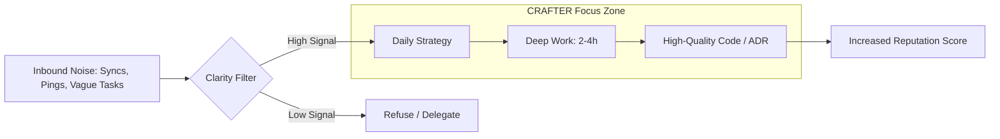

# ⚙️ Execution Playbook (CRAFTER)

> **Goal:** High-bandwidth engineering output through radical focus and systemic discipline.

---

## 🟦 Daily Protocol: The Core Loop
*To be executed every 24 hours to maintain momentum. Use the [Daily Template](./templates/Daily-Checklist.md).*

### 🔍 Signal Processing Flow

### 1. Pre-Flight (10 mins)
- [ ] **Define Top 1–3 Tasks:** Identify high-leverage outcomes. 
    * *Rule: If these are done, the day is a success.*
- [ ] **Clarity Filter:** Do I have a "Definition of Done"? (e.g., "PR opened", not "working on it").
- [ ] **Calendar Defense:** Hard-block **2–4 hours** for Deep Work.

### 2. Deep Work (Execution)
- [ ] **Zero-Noise Environment:** Slack/Phone/Email = OFF.
- [ ] **Single-Tasking:** Work strictly on Task #1 until a logical milestone.
- [ ] **The 20-Min Rule:** If stuck for >20 mins, stop coding. Re-map the problem on paper.

### 3. Post-Flight (10 mins)
- [ ] **Result Delivery:** Close the loop (Commit, PR, or Stakeholder update).
- [ ] **The Seed:** Write down the *very first* step for tomorrow to ensure instant flow.

---

## 🟩 Weekly Protocol: System Calibration
*To be executed every Friday/Sunday to prevent "drift". Use the [Weekly Template](./templates/Weekly-Review.md).*

### 1. Audit Results
- [ ] **Predictability Check:** % of tasks completed vs. planned.
- [ ] **Time Leakage:** Identify the #1 source of distraction this week.

### 2. Optimize Processes
- [ ] **The "One Fix" Rule:** Change one thing in your environment or workflow to fix last week's bottleneck.
- [ ] **Tech Debt Review:** Plan 1 hour to clean up "temporary" code or docs.
- [ ] **ADR Review:** Check if any major technical decisions were made this week.
   - If yes — ensure they are documented in `docs/adr/`.
   - If a decision is pending — move it to `Proposed` status in a new ADR file.

### 3. Strategy & Ideation
- [ ] **The Backlog:** Capture high-level technical ideas without starting them yet.
- [ ] **Skill Delta:** What one thing did I learn? What do I need to learn next?

---

## 🟪 Monthly Protocol: Strategic Reset
*To be executed on the last weekend of the month. Use the [Monthly Template](./templates/Monthly-Reset.md).*

### 1. De-cluttering (Remove)
- [ ] **Audit:** Identify and remove low-impact meetings, tools, or habits.
- [ ] **Technical Debt:** Review "temporary" solutions that now cause friction.

### 2. Expansion (Add & Improve)
- [ ] **North Star:** Set one major engineering goal for the next 30 days.
- [ ] **Anti-Fragility:** Assess upcoming risks and update your mitigation plan.
  
---

## ⚖️ The Hard Rules of CRAFTER

| Situation | Required Action | Principle |
|:---|:---|:---|
| **Zero Progress** | Stop. Change approach or tools immediately. | **Adaptation** |
| **Unfinished Tasks** | Do not add new tasks. Prioritize finishing over starting. | **Execution** |
| **Cognitive Overload** | Stop. Clear the desk. Restore clarity on paper. | **Clarity** |
| **Stagnation** | Increase task difficulty or automate the mundane. | **Growth** |

---

## 🧠 Operational Mindset

- **Standard over Talent:** Rely on your checklist, not your "mood."
- **Focus over Volume:** One finished feature is worth more than five "in-progress" ideas.
- **Data over Ego:** If the metrics say you are slow, the system needs a patch.

---

### 📝 Implementation Tip
Copy the `Daily Protocol` into a file named `Today.md` every morning. For reviews, use the specialized templates in the `/templates` folder to ensure consistent growth data.