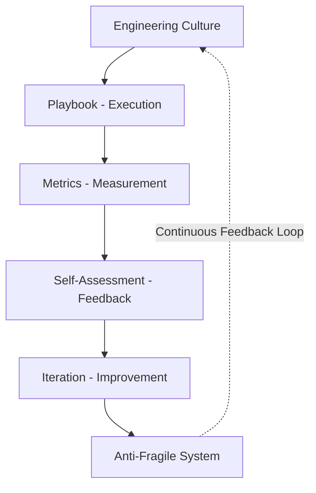
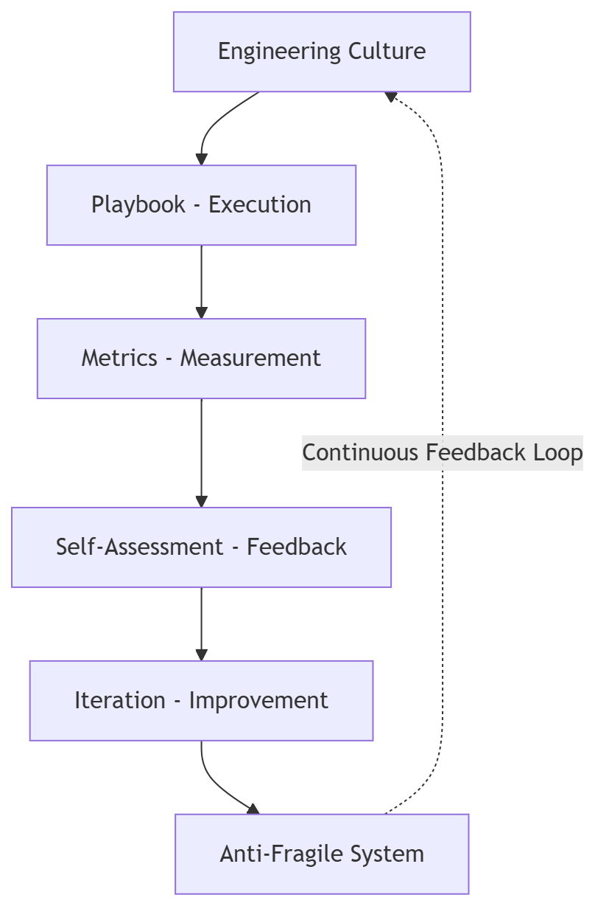

# 🦾 CRAFTER OS
### Engineering Mindset as a System

**The definitive framework for high-performance software engineering.** *"Craft the Mindset. Engineer the Results. Scalable Excellence."*

---

## ⚡ The Problem
Traditional engineering is often a chaotic loop of multitasking, burnout, and unpredictable delivery. Talent is wasted on "noise" instead of "signal". 

## 🛡️ The Solution: CRAFTER OS
**CRAFTER OS** is a deterministic engineering operating system. It provides a rigorous framework to eliminate cognitive friction, maximize deep work, and transform raw coding effort into professional mastery.

---

## 🚀 System Core: C.R.A.F.T.E.R

| Letter | Principle | Industrial Impact |
|:---:|:---|:---|
| **C** | **Cognitive Clarity** | Eliminates "Guess-driven Development" and rework. |
| **R** | **Reputation** | Builds a brand of absolute reliability and trust. |
| **A** | **Adaptation** | Ensures resilience in fast-changing tech environments. |
| **F** | **Focus** | Protects the engineering "Flow State" from distractions. |
| **T** | **Technical Mastery** | Systematic approach to deep expertise, not just syntax. |
| **E** | **Execution** | The art of finishing. Zero "half-done" tasks. |
| **R** | **Responsibility** | End-to-end ownership of the problem and the solution. |

> [**Deep dive into CRAFTER Principles →**](./CRAFTER.md)

---

## 🧠 System Architecture

The system operates as a **Continuous Improvement Engine**. It is designed to be anti-fragile: the more you use it, the stronger your engineering process becomes.

  

---

## ⚙️ Operating Modules

CRAFTER is modular. Implement the components you need, then scale.

* 📂 **[Culture](./Engineering.md)** — The foundational engineering mindset.
* 📂 **[Playbook](./Playbook.md)** — Tactical execution and Daily protocols.
* 📂 **[Metrics](./Metrics.md)** — Tracking Lead Time, Predictability, and Focus.
* 📂 **[Feedback Loop](./Self-Assessment.md)** — Protocols for Self-Correction.
* 📂 **[FAQ](./docs/Faq.md)** — Frequently Asked Questions & Troubleshooting.
* 📂 **[Team-Roadmap](./Team-Roadmap.md)** — Scaling the system for groups.
* 📂 **[Enterprise](./docs/Enterprise.md)** — Enterprise-grade deployment and ROI.

---

## 👥 Audience

### 🥇 Primary
- **Software Engineers (Mid → Staff):** Master self-management and output quality.
- **Tech Leads & Architects:** Build high-performance, predictable teams.

### 🥈 Secondary
- **DevOps:** Standardize operational execution.
- **QA Engineers:** Shift-left quality through engineering discipline.

---

## 📈 Value Proposition

### 🔥 High-Performance Execution
- **Focus:** Eliminate context switching via 2-4h Deep Work blocks.
- **Predictability:** Consistent delivery timelines based on real metrics.
- **Quality:** Built-in "Definition of Done" for every task.

### 🧠 Strategic Thinking
- **Cognitive Clarity:** Decisions driven by logic, not stress.
- **System Reasoning:** Move from "fixing bugs" to "engineering systems".
- **Anti-Fragility:** Learn and improve from every failure.

---

## 💰 Business Impact

CRAFTER converts engineering discipline into business ROI:

- **Reduced Waste:** Less time spent on vague tasks and rework.
- **Faster Time-to-Market:** Efficient execution loops speed up shipping.
- **Lower "Bus Factor":** Systemized knowledge prevents single-point-of-failure.
- **Retention:** High-performers thrive in a structured, distraction-free environment.

---

## 🛠 How to Initialize

1. **Step 1: Understand** — Read the [CRAFTER Principles](./CRAFTER.md).
2. **Step 2: Execute** — Adopt the [Daily Playbook](./Playbook.md).
3. **Step 3: Track** — Log your performance in [Metrics.md](./Metrics.md).
4. **Step 4: Recalibrate** — Run a [Weekly Review](./Weekly-Review.md) to optimize.

---

## 🧬 Core Philosophy

- **Systems > Motivation:** Motivation is a feeling; systems are a commitment.
- **Execution > Intentions:** What you ship is what defines you.
- **Clarity > Complexity:** If you can't explain it simply, you haven't engineered it.
- **Adaptation > Rigidity:** The system evolves as you grow.

---

## 🎯 The End State

The goal is to develop an engineer who:
- Thinks with **Clarity**.
- Executes with **Focus**.
- Delivers with **Consistency**.
- Adapts through **Metrics**.

---

## ⚠️ What CRAFTER is NOT

- It is **not** a tech stack or language-specific guide.
- It is **not** a Jira replacement (it's how you *use* the tools).
- It is **not** a rigid set of rules (it's a framework to be adapted).

---

## 📜 License

Copyright © 2026. Licensed under the **Business Source License 1.1** [(BSL-1.1)](./LICENSE.md).

- **Personal/Educational use:** FREE 🟢
- **Commercial/Production use:** Requires a license 🔴

*On 2028-01-01, this license will automatically convert to the Apache License 2.0.*

---

    <b>Contact & Inquiries:</b> 
    Nikolay Selyutin — <code>nselyutin@gmail.com</code>

