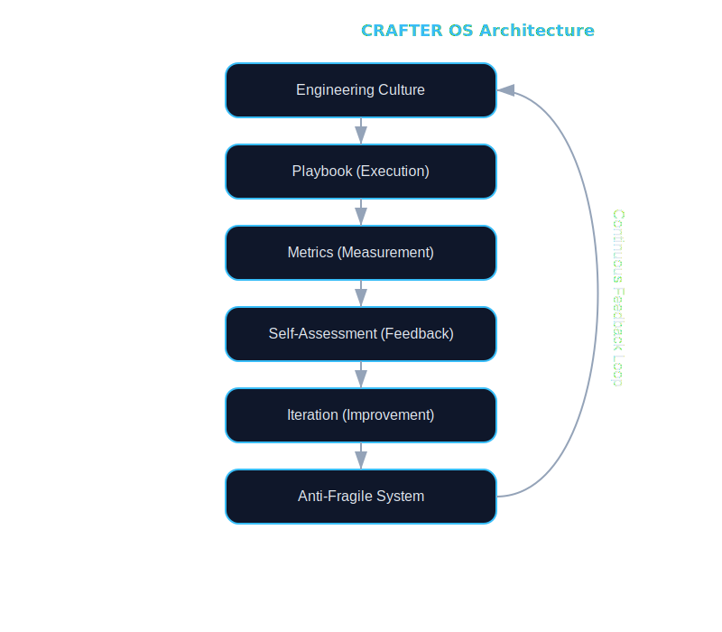

# 🦾 CRAFTER OS

  <strong>Engineering mindset as a system</strong> 
  Craft the engineer. Engineer the system.

  
  
  
  

## 🚀 What is CRAFTER?

**CRAFTER OS** is an engineering operating system that transforms:

- mindset → structured thinking
- execution → consistent delivery
- discipline → measurable results

It is designed to turn engineers into **high-performance, self-improving systems**.

---

## 🔤 C.R.A.F.T.E.R

| Principle | Meaning |
|----------|--------|
| **C** | Cognitive Clarity — clear thinking |
| **R** | Reputation — consistent reliability |
| **A** | Adaptation — flexibility under change |
| **F** | Focus — deep work, no noise |
| **T** | Technical Mastery — deep expertise |
| **E** | Execution — finishing tasks |
| **R** | Responsibility — ownership end-to-end |

[Full breakdown](./CRAFTER.md)

---

## 🧠 System Architecture

---

## ⚙️ Core Components

| Component                                  | Description |
|--------------------------------------------|------------|
| [Engineering](./Engineering.md)            | Engineering culture |
| [Playbook.md](./Playbook.md)               | Execution system |
| [Metrics.md](./Metrics.md)                 | Measurement |
| [Self-assessment.md](./Self-Assessment.md) | Feedback loop |
| [Team-Roadmap.md](./Team-Roadmap.md)       | Team adoption |
| [Enterprise.md](./docs/Enterprise.md)      | Enterprise |

---

## 👥 Who is this for?

### 🥇 Primary
- Software Engineers (Mid → Staff)
- Tech Leads / Architects

### 🥈 Secondary
- DevOps / SRE
- QA Engineers

### 🥉 Partial
- Product Managers
- Designers

→ [Detailed roles](./docs/Roles.md)

---

## 📈 What You Get

### 🔥 Performance
- +20–50% productivity (focus + execution)
- reduced context switching
- faster delivery

### 🧠 Thinking
- structured decision-making
- system-level reasoning
- reduced cognitive load

### ⚙️ Execution
- consistent output
- predictable results
- fewer unfinished tasks

### 🚀 Growth
- continuous improvement
- built-in learning loop
- idea generation system

---

## 💰 Business Impact

CRAFTER converts discipline into ROI:

- reduced wasted engineering time
- faster time-to-market
- fewer production issues
- lower dependency on external training

**Result:** higher output with the same team.

---

## 🛠 How to Use

### Step 1 — Understand the system
→ Read [CRAFTER.md](./CRAFTER.md)

### Step 2 — Apply daily
→ Use [Playbook.md](./Playbook.md)

### Step 3 — Measure
→ Track via [Metrics.md](./Metrics.md)

### Step 4 — Improve
→ Use [Self-assessment.md](./Self-assessment.md)

---

## 🧬 Philosophy

- Systems > Motivation
- Execution > Intentions
- Clarity > Complexity
- Adaptation > Rigidity

---

## 🔁 Feedback Loop

Think → Execute → Measure → Reflect → Improve → Repeat

### The Growth Engine
Unlike one-time workshops, CRAFTER creates a **perpetual feedback loop**:
1. **Think** (Clarity) — Eliminate the non-essential.
2. **Execute** (Focus) — Ship the high-impact.
3. **Measure** (Metrics) — Confront the data.
4. **Reflect** (Review) — Identify the leverage points.
5. **Improve** (Adaptation) — Adjust the system.

---

## 🎯 End State

An engineer who:

- thinks clearly
- executes consistently
- adapts quickly
- delivers reliably
- improves continuously

---

## ⚠️ What CRAFTER is NOT

- not a tech stack
- not a framework for code
- not a replacement for knowledge

It is a **multiplier of capability**.

---

## 📜 License

This project is licensed under the **Business Source License 1.1** (BSL-1.1).

- **Personal/Educational use:** FREE 🟢
- **Commercial/Production use:** Requires a separate license 🔴

On **2028-01-01**, the license will automatically convert to **Apache License 2.0**.

Full details can be found in [LICENSE.md](./LICENSE.md).
For commercial inquiries, contact: nselyutin@gmail.com