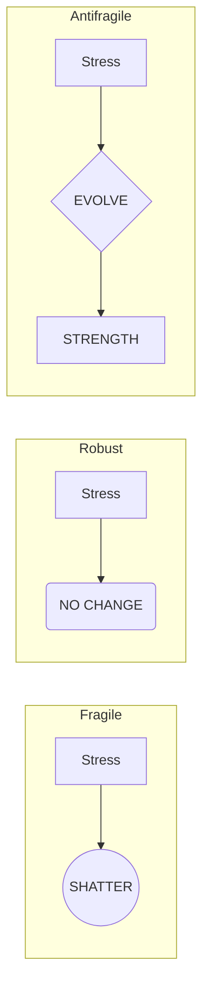
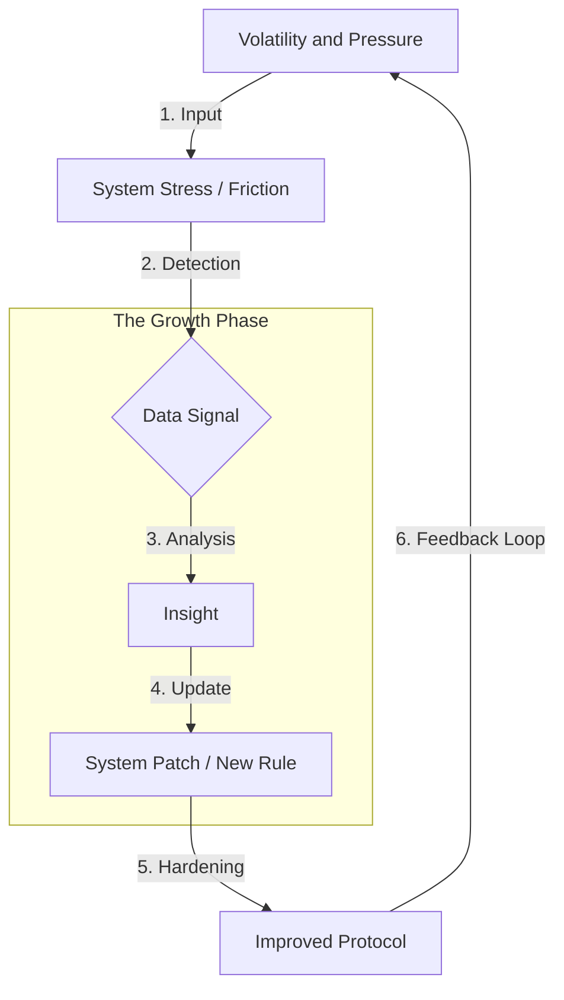

# 🧬 Antifragile System

CRAFTER OS is designed not only to withstand stress, but to improve because of it. It moves beyond mere robustness to ensure that volatility becomes your greatest asset.

---

## 📌 The Spectrum of Systems

| Type | Response to Stress | Goal |
|:---|:---|:---|
| **Fragile** | Breaks easily under pressure | Avoidance of disorder |
| **Robust** | Resists stress, stays the same | Endurance and stability |
| **Antifragile** | **Grows and improves from stress** | **Exploiting disorder** |

> "Antifragility is beyond resilience or robustness. The resilient resists shocks and stays the same; the antifragile gets better." — *Nassim Taleb*

---

## 🔁 The Core Mechanism: Stress-to-Signal

The system functions like a biological muscle: targeted stress creates micro-tears (signals), which the system repairs to become stronger than before.

---

## ⚙️ How It Works in CRAFTER

### 1. Error Conversion (Post-Mortem Thinking)
In CRAFTER, an error is a **low-cost gift of information**.
- **Signal Mining:** We don't just fix the bug; we fix the *systemic assumption* that allowed the bug to exist.
- **Fail-Safe Loops:** Every incident triggers an update to the [Playbook](../Playbook.md), ensuring the same "stressor" never works twice.

### 2. Constraint-Driven Execution
Pressure is a filter that removes non-essential complexity.
- **Strict Time-Boxing:** Using tight constraints to force **Cognitive Clarity**.
- **Execution under Load:** CRAFTER protocols (like the Stall Protocol) are designed to function best when you are stuck or overwhelmed.

### 3. Deliberate Variability
Stability is often a trap that hides hidden risks. CRAFTER encourages:
- **Assumption Testing:** Regularly challenging your own "best practices."
- **Small-Scale Experimentation:** High-frequency, low-risk iterations to explore system limits before they are reached in production.

---

## 🧠 The Antifragile Engineer Mindset

An engineer operating on CRAFTER OS doesn't just survive the "crunch time" — they use it to upgrade their workflow.

* **Loves the Friction:** Every difficult task is a diagnostic tool for their own skills.
* **Decentralized Intelligence:** Doesn't rely on a "stable" manager or company; builds a portable, robust system of self-management.
* **Hyper-Adaptive:** Shifts focus instantly based on the "Signal" provided by [Metrics](../Metrics.md).

---

## 🔄 The Antifragility Loop (Practical Steps)

1.  **Expose:** Don't hide failures; make them visible through [Self-Assessment](../Self-Assessment.md).
2.  **Analyze:** Identify if the failure was a *Signal* (systemic) or *Noise* (random).
3.  **Synthesize:** Turn the insight into a new "Check" in your Daily Routine.
4.  **Strengthen:** Implement the change immediately.
5.  **Repeat:** Increase complexity to test the new version of the system.

---

## ⚠️ Anti-Patterns (The "Fragility" Trap)

* **Over-Optimization:** Creating a workflow that only works when everything is perfect (no pings, no bugs, no meetings).
* **Debt-Hiding:** Ignoring technical or process debt until it causes a catastrophic break.
* **Rigid Standard Operating Procedures (SOPs):** Processes that cannot be changed by the person executing them.
* **Fear of Chaos:** Viewing uncertainty as a threat rather than an opportunity to outpace competitors.

---

## 🎯 Final Outcome

By implementing CRAFTER OS, you build a system that:
- **Gains Energy** from complexity.
- **Self-Corrects** before the "crash."
- **Scales** without increasing cognitive load.

> **Stress is not the enemy.** > **Stagnation is. Adapt or break.**