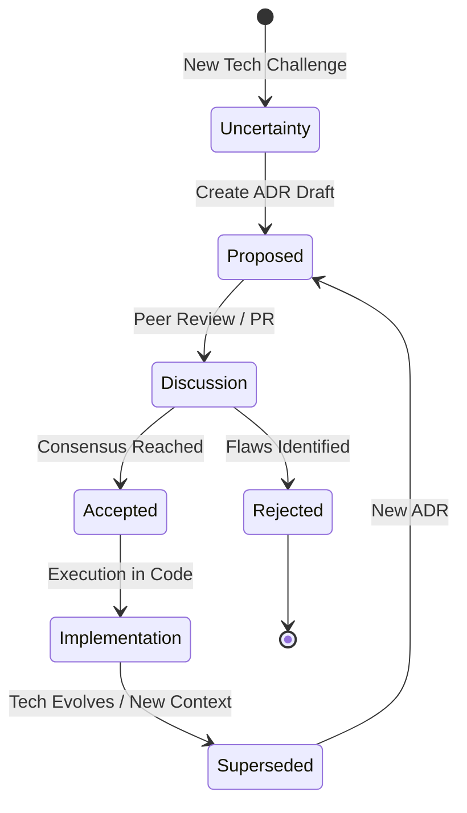

# ADR [Number]: [Decision Title]

### 🔄 Decision Lifecycle

* **Date:** YYYY-MM-DD
* **Author:** [Username]
* **Status:** [Proposed / Accepted / Superseded / Rejected]

## 1. Context
What is the specific problem we are solving? What are the technical or business constraints driving this change?

## 2. Decision
What is the chosen solution? Describe the architecture, patterns, or tools to be implemented.

## 3. Alternatives Considered
What other options were evaluated? Why were they rejected? (e.g., higher complexity, lack of scalability).

## 4. Consequences
* **Positive:** What are the expected gains in performance, clarity, or velocity?
* **Negative:** What is the cost? (e.g., technical debt, increased onboarding time, maintenance overhead).

## 5. CRAFTER Alignment
How does this decision support **Adaptation**? Does it reduce **System Noise**?